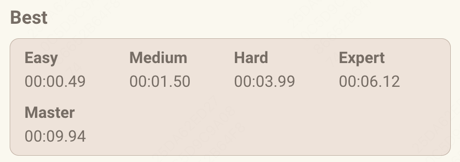

# ShikakuPuzzleSolution

A ~~noob~~ **blazing fast** solution for [Daily Shikaku Puzzle](https://shikakuofthe.day/master) writen by Deno.

## Usage


### just download it

- Copy `./dist/bundle.js` to your TemperMonkey plugin
- Open Puzzle website
- Wait for a few seconds, *Answer* Button will be attached in the `Clear All / Undo` actions line
- Click *Answer* to get the Answer (if at Master level, Your website may be stucked for a while)

### build by your own

```
deno run -A ./build.ts
```


### Cannot see *Answer* Button?

- F12 to open web console
- use `window.start()` to start the game

## Performance



- Master: less than 10s
- Expert / Hard / Medium: about 3-6s
- Eazy: 1s
